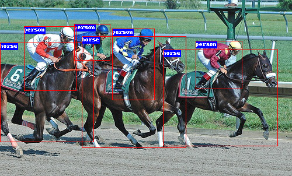

# FCOS in Pytorch

An unofficial implementation of FCOS in Pytorch. 
FCOS: Fully Convolutional One-Stage Object Detection.

https://arxiv.org/abs/1904.01355

**Some modifies are adopted:**

- Remove *center-ness* branch for simplicity.
- Add center sample mechanism to improve performance.
- Note: GPUCompute Capability >= 6.1

| paper (800px) | official (800px) | ours (nearly 700px) |
| :-----------: | :--------------: | :-----------------: |
|     36.6      |       38.7       |      **37.1**       |




Some *cuda* operations are provided for acceleration. 

```bash
cd libs/nms_cuda
python setup.py install
cd libs/sigmoid_focal_loss_cuda
python setup.py install
cd libs/assign_box_cuda
python setup.py install
```

## COCO (2x)

1. Copy configs/detector_coco.py to ./detector.py
2. Copy configs/train_coco_2x.json to ./train.json
3. Configure train.json file, add your root. 
4. Command: *python run_train.py*  to start schedule, it takes about 30 hours with 8x Titan-XP.
5. Command: *python run_analyze.py*  to get mAP curves.
6. Command: *python run_cocoeval.py*  to get mAP.

```python
map_mean
[0.1291 0.1895 0.2261 0.2421 0.2528 0.2578 0.2731 0.2778 0.2769 0.2809
 0.2946 0.2913 0.2971 0.2916 0.2961 0.3052 0.3559 0.3587 0.3584 0.3645
 0.366  0.3679 0.3683 0.3684]
map_50
[0.2468 0.3396 0.381  0.4007 0.4187 0.4281 0.4404 0.4444 0.4438 0.45
 0.46   0.4642 0.4665 0.4651 0.4659 0.4779 0.5373 0.54   0.539  0.546
 0.5461 0.548  0.5485 0.5489]
map_75
[0.1235 0.1929 0.2335 0.2541 0.2687 0.2672 0.2902 0.2892 0.2941 0.2993
 0.3148 0.3096 0.3147 0.3098 0.316  0.325  0.3771 0.3817 0.3808 0.3892
 0.3914 0.3937 0.3952 0.3952]
```

```python
 Average Precision  (AP) @[ IoU=0.50:0.95 | area=   all | maxDets=100 ] = 0.371
 Average Precision  (AP) @[ IoU=0.50      | area=   all | maxDets=100 ] = 0.554
 Average Precision  (AP) @[ IoU=0.75      | area=   all | maxDets=100 ] = 0.397
 Average Precision  (AP) @[ IoU=0.50:0.95 | area= small | maxDets=100 ] = 0.198
 Average Precision  (AP) @[ IoU=0.50:0.95 | area=medium | maxDets=100 ] = 0.408
 Average Precision  (AP) @[ IoU=0.50:0.95 | area= large | maxDets=100 ] = 0.483
 Average Recall     (AR) @[ IoU=0.50:0.95 | area=   all | maxDets=  1 ] = 0.302
 Average Recall     (AR) @[ IoU=0.50:0.95 | area=   all | maxDets= 10 ] = 0.481
 Average Recall     (AR) @[ IoU=0.50:0.95 | area=   all | maxDets=100 ] = 0.524
 Average Recall     (AR) @[ IoU=0.50:0.95 | area= small | maxDets=100 ] = 0.328
 Average Recall     (AR) @[ IoU=0.50:0.95 | area=medium | maxDets=100 ] = 0.573
 Average Recall     (AR) @[ IoU=0.50:0.95 | area= large | maxDets=100 ] = 0.630
```
