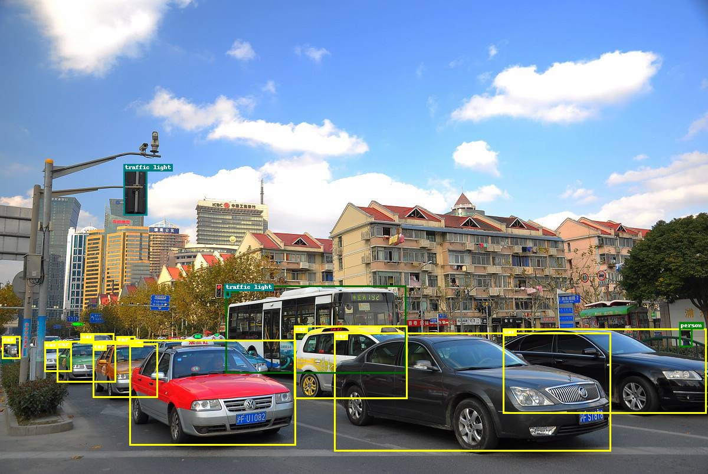

# FCOS in Pytorch

An unofficial implementation of FCOS in Pytorch. 
FCOS: Fully Convolutional One-Stage Object Detection.

https://arxiv.org/abs/1904.01355

**Some modifies are adopted:**

- Remove *center-ness* branch for simplicity.
- Add center sample mechanism to improve performance.
- Predect yxhw instead of tlbr +0.3Map.
- Note: GPU Compute Capability >= 6.1 (pytorch>=1.0.0)

**Download:**

- Baidu https://pan.baidu.com/s/1MjsgE2fu86qmWZpVD7a8Aw
- Google https://drive.google.com/open?id=1U-jwZV54ydiuLR5zcOzdbGDXUNDKJZtU

| paper (800px) | official (800px) | ours (nearly 700px) |
| :-----------: | :--------------: | :-----------------: |
|     36.6      |       38.7       |      **37.3**       |



Some *cuda* operations are provided for acceleration. 

```bash
cd libs/nms_cuda
python setup.py install
cd libs/sigmoid_focal_loss_cuda
python setup.py install
cd libs/assign_box_cuda
python setup.py install
```

## Inference

1. Copy your images (xxx.jpg) to /images.
2. Command: *python run_demo.py*

## COCO (2x)

1. Copy configs/detector_coco.py to ./detector.py
2. Copy configs/train_coco_2x.json to ./train.json
3. Configure train.json file, add your root. 
4. Command: *python run_train.py*  to start schedule, it takes about 30 hours with 8x Titan-XP.
5. Command: *python run_analyze.py*  to get mAP curves.
6. Command: *python run_cocoeval.py*  to get mAP.

```python
map_mean
[0.1345 0.1984 0.2192 0.2468 0.2496 0.2606 0.2729 0.2708 0.2768 0.2872
 0.2924 0.295  0.2973 0.3041 0.2927 0.3027 0.3565 0.3583 0.3622 0.3642
 0.3659 0.3679 0.3689 0.37  ]
map_50
[0.2482 0.3404 0.3749 0.3997 0.4059 0.4182 0.4401 0.4393 0.4389 0.4496
 0.4584 0.4646 0.4618 0.4719 0.4584 0.4741 0.535  0.5385 0.5405 0.5436
 0.5457 0.5489 0.5497 0.5511]
map_75
[0.1304 0.2044 0.2265 0.2596 0.2595 0.2758 0.2895 0.283  0.2914 0.3037
 0.311  0.315  0.3145 0.3246 0.3136 0.3232 0.3804 0.3829 0.3869 0.3906
 0.3917 0.3924 0.3943 0.3962]
```

```python
 Average Precision  (AP) @[ IoU=0.50:0.95 | area=   all | maxDets=100 ] = 0.373
 Average Precision  (AP) @[ IoU=0.50      | area=   all | maxDets=100 ] = 0.556
 Average Precision  (AP) @[ IoU=0.75      | area=   all | maxDets=100 ] = 0.398
 Average Precision  (AP) @[ IoU=0.50:0.95 | area= small | maxDets=100 ] = 0.198
 Average Precision  (AP) @[ IoU=0.50:0.95 | area=medium | maxDets=100 ] = 0.411
 Average Precision  (AP) @[ IoU=0.50:0.95 | area= large | maxDets=100 ] = 0.486
 Average Recall     (AR) @[ IoU=0.50:0.95 | area=   all | maxDets=  1 ] = 0.303
 Average Recall     (AR) @[ IoU=0.50:0.95 | area=   all | maxDets= 10 ] = 0.482
 Average Recall     (AR) @[ IoU=0.50:0.95 | area=   all | maxDets=100 ] = 0.525
 Average Recall     (AR) @[ IoU=0.50:0.95 | area= small | maxDets=100 ] = 0.326
 Average Recall     (AR) @[ IoU=0.50:0.95 | area=medium | maxDets=100 ] = 0.575
 Average Recall     (AR) @[ IoU=0.50:0.95 | area= large | maxDets=100 ] = 0.639
```

## VOC0712 (30 epoches)

1. Copy configs/detector_voc.py to ./detector.py
2. Copy configs/train_voc.json to ./train.json
3. Configure train.json file, add your root. 
4. Command: *python run_train.py*  to start schedule.
5. Command: *python run_analyze.py*  to get mAP curves.

```python
map_mean
[0.0315 0.174  0.2992 0.3442 0.3567 0.3983 0.4329 0.4475 0.44   0.4525
 0.4397 0.472  0.4743 0.475  0.464  0.4885 0.4855 0.4908 0.4923 0.4776
 0.529  0.5331 0.535  0.5375 0.5371 0.5348 0.538  0.537  0.5378 0.5368]
map_50
[0.0721 0.3466 0.5524 0.594  0.6051 0.6488 0.6968 0.7062 0.7001 0.7205
 0.6982 0.7211 0.7258 0.7276 0.7092 0.7408 0.7381 0.7362 0.7295 0.7246
 0.7682 0.7718 0.7736 0.7771 0.7741 0.7725 0.7767 0.7737 0.7744 0.7732]
map_75
[0.0219 0.1561 0.2932 0.3555 0.3639 0.4224 0.4618 0.4781 0.4718 0.4849
 0.479  0.5084 0.5147 0.5116 0.4989 0.5293 0.5259 0.5244 0.5292 0.5174
 0.574  0.5789 0.5797 0.5792 0.5794 0.5805 0.5858 0.5814 0.5829 0.5819]
```

## How to change resolution ?

To change the prediction resolution, you need to modify the following parameters.
Note that the resolution must be 128*n+1 (n=1,2,3...).

```python
# ---------------------------
self.view_size = 1025 # 128*n+1
self.phpw = [[129, 129], [65, 65], [33, 33], [17, 17], [9, 9]]
# [[16n+1, 16n+1], [8n+1, 8n+1], [4n+1, 4n+1], [2n+1, 2n+1], [n+1, n+1]]
# ---------------------------
```

## How to train your own data ?

1. Create data_name.txt

```python
background
classname1
classname2
classname3
```

2. Create data_train.txt

```python
xxx1.jpg 237 411 480 504 1 313 9 391 151 3
xxx2.jpg 261 234 553 134 2
# img_name ymin xmin ymax xmax class_id ymin xmin ymax xmax class_id ... \n 
```

3. Create data_eval.txt (same format as data_train.txt)
4. Config train.json file, add your root.

## Call for suggestions !

We can't achieve the above results in standard 12-epoch training, even if we add the center branch. The possible reasons are: 1. Instead of set minimum side to 800, we set the maxmal side to 1025. 2. There are some tricks we haven't adopted.
